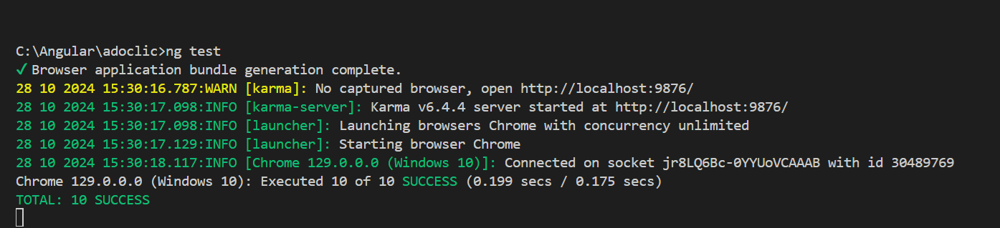
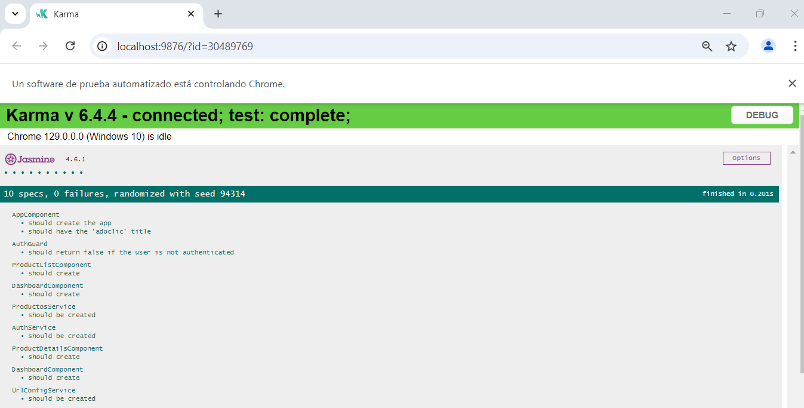
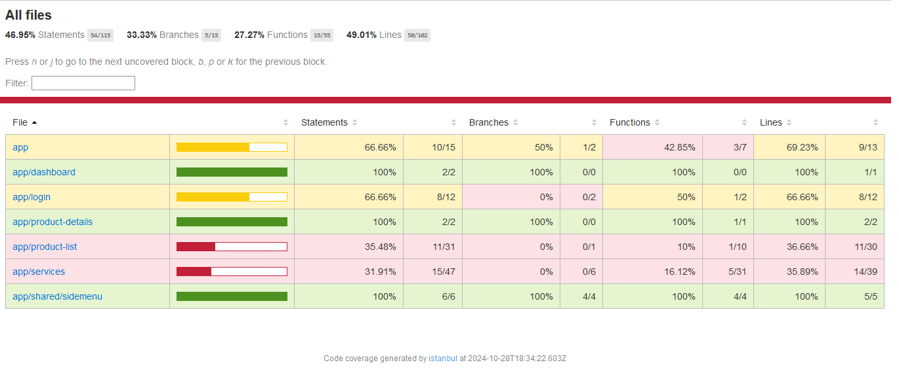

# Documentación para Ejecución de Pruebas Unitarias en Angular

## Introducción
Este documento describe cómo ejecutar pruebas unitarias en la aplicación Angular y cómo interpretar los resultados obtenidos. Las pruebas se han implementado utilizando **Jasmine** y **Karma**, que son herramientas estándar para pruebas en aplicaciones Angular.

## Ejecución de Pruebas Unitarias

### Prerequisitos
Antes de ejecutar las pruebas, asegúrate de que tu entorno de desarrollo esté correctamente configurado:

- **Node.js**: Debes tener instalado Node.js en tu máquina. Puedes descargarlo desde [nodejs.org](https://nodejs.org).
- **Angular CLI**: Asegúrate de tener Angular CLI instalado. Si no lo tienes, puedes instalarlo con el siguiente comando:

    ```bash
    npm install -g @angular/cli
    ```

### Comandos para Ejecutar Pruebas
Para ejecutar las pruebas unitarias, abre la terminal en la carpeta raíz del proyecto y utiliza los siguientes comandos:

- **Ejecutar todas las pruebas**:

    ```bash
    ng test
    ```

    Se abrirá un navegador y ejecutará todas las pruebas en un entorno de desarrollo.

- **Ejecutar pruebas en modo "watch"**:

    ```bash
    ng test --watch
    ```

    Se mantiene el proceso activo y ejecuta las pruebas automáticamente cada vez que se realice un cambio en el código.

## Resultados de las Pruebas
Una vez que se ejecuten las pruebas, se verá salida en la terminal y en el navegador con los siguientes elementos:

- **Número de pruebas ejecutadas**: Muestra cuántas pruebas se han ejecutado en total.
- **Pruebas pasadas**: Se indicará cuántas pruebas se han pasado exitosamente.
- **Pruebas fallidas**: Si hay pruebas que no han pasado, se mostrarán en rojo con detalles sobre el error.
- **Detalles de errores**: Se proporcionarán mensajes de error que explican por qué la prueba falló, incluyendo la línea de código donde ocurrió el error y la razón del fallo.

## Interpretación de Resultados

### Pruebas Pasadas
Si todas las pruebas pasan, verás un mensaje indicando que todas las pruebas se han completado exitosamente. Esto significa que tu componente está funcionando como se esperaba.

### Pruebas Fallidas
Si alguna prueba falla, revisa el mensaje de error proporcionado. Los errores suelen incluir información como:

- El nombre de la prueba que falló.
- La descripción del fallo.
- La línea de código donde ocurrió el error.

Utiliza esta información para depurar el código y corregir el problema. Una vez que hayas realizado las correcciones, vuelve a ejecutar las pruebas para verificar que ahora todas pasen.

### Cobertura de Pruebas
Puedes verificar la cobertura de pruebas utilizando el siguiente comando:

```bash
ng test --code-coverage
```

# RESULTADOS PRUEBA:




### Para ver el informe completo hay que abrir el index que esta dentro de la carpeta coverage:
```bash
coverage\adoclic\index.html
```


